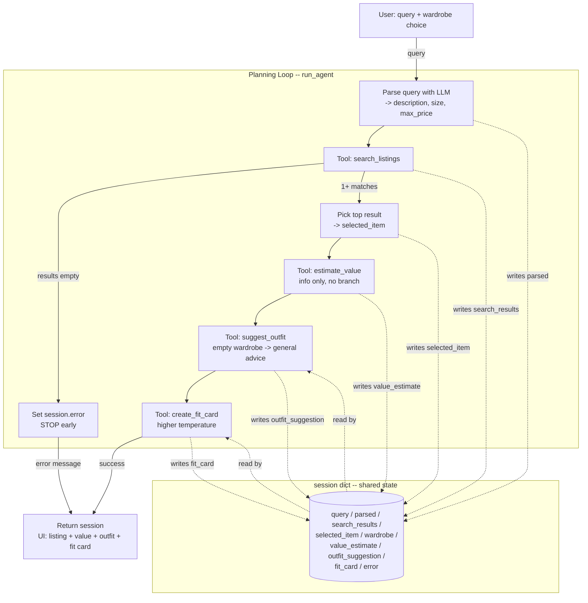

# FitFindr — planning.md

> Complete this document before writing any implementation code.
> Your spec and agent diagram are what you'll use to direct AI tools (Claude, Copilot, etc.) to generate your implementation — the more specific they are, the more useful the generated code will be.
> Your planning.md will be reviewed as part of your submission.
> Update it before starting any stretch features.

---

## Tools

List every tool your agent will use. For each tool, fill in all four fields.
You must have at least 3 tools. The three required tools are listed — add any additional tools below them.

### Tool 1: search_listings

**What it does:**
Searches the mock listings for items that match what the user described, throws out
anything too expensive or in the wrong size, and ranks whatever's left by how well it
matches the description.

**Input parameters:**
- `description` (str): keywords for what the user wants, like `"vintage graphic tee"`. Required.
- `size` (str | None): size to filter by. I match it case-insensitively as a substring so `"M"` still matches a listing tagged `"S/M"`. Pass `None` to skip size filtering.
- `max_price` (float | None): highest price I'll allow, inclusive. `None` skips the price filter.

**What it returns:**
A `list[dict]` of listings, best match first. Each dict is a full listing with `id`,
`title`, `description`, `category`, `style_tags`, `size`, `condition`, `price`,
`colors`, `brand`, and `platform`. If nothing matches it returns an empty list — it
doesn't raise.

**What happens if it fails or returns nothing:**
It just returns `[]`. The agent loop notices the empty list, sets a useful error
message on the session ("nothing under $Y in size Z, try loosening a filter"), and
stops there. It does not call `suggest_outfit` with an empty item.

---

### Tool 2: suggest_outfit

**What it does:**
Takes the item the user is looking at plus their current wardrobe and asks the LLM for
one or two full outfits built around that item, using stuff they already own.

**Input parameters:**
- `new_item` (dict): the listing the user picked.
- `wardrobe` (dict): has an `"items"` key with a list of wardrobe pieces (`id`, `name`, `category`, `colors`, `style_tags`, `notes`). Can be empty.

**What it returns:**
A non-empty `str` with the outfit ideas. If the wardrobe has pieces in it, the
suggestions name specific ones. If the wardrobe is empty, it gives general styling
advice for the item instead (what kinds of things go with it, what vibe it fits).

**What happens if it fails or returns nothing:**
If the wardrobe is empty I switch to the general-advice prompt instead of failing. If
the LLM call itself throws (bad key, network), I catch it and return a plain fallback
string so the agent can still keep going to the fit card instead of crashing.

---

### Tool 3: create_fit_card

**What it does:**
Turns the outfit suggestion and the item details into a short, casual caption — the
kind of thing you'd actually put on an OOTD post.

**Input parameters:**
- `outfit` (str): the suggestion string from `suggest_outfit()`.
- `new_item` (dict): the listing, so the caption can pull the name, price, and platform.

**What it returns:**
A 2–4 sentence `str` caption. It mentions the item name, price, and platform once
each, gets the vibe of the outfit in there, and reads like a real post instead of a
product blurb. I run it at a higher temperature so it comes out different each time.

**What happens if it fails or returns nothing:**
If `outfit` is empty or just whitespace, it returns an error string instead of
raising. If the LLM call fails, it falls back to a simple caption built straight from
the item fields so the user still gets something.

---

### Additional Tools (if any)

### Tool 4: estimate_value (stretch)

**What it does:**
Looks at one listing and gives a quick gut-check on whether the price is fair for the
condition, brand, category, and platform — basically the "is this actually a good
deal?" question you ask every time you thrift something.

**Input parameters:**
- `item` (dict): a listing (uses `title`, `category`, `condition`, `price`, `brand`, `platform`).

**What it returns:**
A short `str` verdict with a one-line reason, like "Fair — $22 is about right for a
good-condition unbranded Y2K tee on Depop." It's just info, it doesn't change the rest
of the flow.

**What happens if it fails or returns nothing:**
If there's no price it returns "Can't assess — no price listed" instead of guessing.
If the LLM call fails it returns "Price check unavailable" and the loop keeps going.
This one is a nice-to-have, so it never blocks anything.

---

## Planning Loop

**How does your agent decide which tool to call next?**

The loop runs off the session dict. At each step it looks at what the last tool put
there and decides whether to keep going or stop.

1. **Parse** the query into `{description, size, max_price}` with an LLM call that
   returns JSON, and save it to `session["parsed"]`. I went with the LLM instead of
   regex because people write size and price a bunch of different ways ("size medium",
   "M", "under thirty bucks") and the LLM handles all of them the same. If the JSON
   doesn't parse, I fall back to using the whole query as the description with no
   size/price filter.
2. **Search** with `search_listings(**parsed)` and save to `session["search_results"]`.
   - This is the one real branch: if the list is empty, set `session["error"]` and
     return right there. Nothing downstream gets called with empty input.
3. **Pick** the top result (`search_results[0]`) and save it as `session["selected_item"]`.
4. **Value check (stretch)**: call `estimate_value(selected_item)` and save it to
   `session["value_estimate"]`. This never changes what happens next, it's just info.
5. **Suggest** an outfit with `suggest_outfit(selected_item, wardrobe)` →
   `session["outfit_suggestion"]`. The empty-wardrobe case is handled inside the tool.
6. **Fit card**: `create_fit_card(outfit_suggestion, selected_item)` →
   `session["fit_card"]`.
7. **Done**: return the session. The loop knows it's finished when `fit_card` is set
   (success) or `error` is set (stopped early).

The point is it's not a fixed pipeline — whether steps 3–6 even run depends on what
the search returned. That branch is the actual planning decision.

---

## State Management

**How does information from one tool get passed to the next?**

Everything for one interaction lives in a single `session` dict that `_new_session()`
sets up. Each step reads the fields it needs and writes its result back, so the user
never has to re-type anything. The item that `search_listings` finds flows into
`suggest_outfit`, and that suggestion flows into `create_fit_card`.

| Field | Written by | Read by |
|-------|-----------|---------|
| `query` | `_new_session` | parse step |
| `parsed` | parse step | search step |
| `search_results` | `search_listings` | pick step / empty check |
| `selected_item` | pick step | `estimate_value`, `suggest_outfit`, `create_fit_card` |
| `wardrobe` | `_new_session` | `suggest_outfit` |
| `value_estimate` | `estimate_value` | final output / UI |
| `outfit_suggestion` | `suggest_outfit` | `create_fit_card`, final output |
| `fit_card` | `create_fit_card` | final output |
| `error` | whatever step stops early | checked first by the caller |

The caller (the CLI or the Gradio app) checks `session["error"]` first. If it's set,
the other output fields are `None` and it shows the error instead.

---

## Error Handling

For each tool, describe the specific failure mode you're handling and what the agent does in response.

| Tool | Failure mode | Agent response |
|------|-------------|----------------|
| search_listings | Nothing matches the query | Returns `[]`; the loop sets a specific error ("nothing under $X in size Y, try loosening a filter") and stops before `suggest_outfit`. |
| suggest_outfit | Wardrobe is empty | Sees the empty `items` list, switches to a general styling-advice prompt, and still returns a real string so the flow keeps going. |
| create_fit_card | Outfit string is empty/missing | Checks for an empty or whitespace-only `outfit` and returns an error string instead of crashing; the UI shows it. |
| estimate_value | No price, or LLM error | Returns "Can't assess — no price listed" or "Price check unavailable". It's info only, so it never stops the flow. |

---

## Architecture

The whole orchestration lives inside the **Planning Loop** (`run_agent`), which reads
and writes the shared `session` dict at every step. The only branch is at
`search_listings`: an empty result jumps to the error path and stops early, while one
or more matches stays on the happy path through to the fit card.

---

## AI Tool Plan

**AI tool:** Claude Code. For each piece below I hand Claude the matching part of this
planning.md (the tool's four fields, or the Planning Loop / State sections) plus the
docstring that's already in `tools.py` / `agent.py`, and have it implement against
that. Then I test before moving on.

**Milestone 3 — Individual tool implementations:**
- **search_listings:** give Claude the Tool 1 spec and the `load_listings()` docstring.
  I expect filtering by price/size and scoring by keyword overlap with `description`,
  dropping anything that scores zero. Test: a normal query ("vintage graphic tee"), a
  size-filtered one ("size M"), and a no-match one ("designer ballgown size XXS under
  $5") — that last one should come back empty.
- **suggest_outfit:** give it the Tool 2 spec plus a sample listing and the example
  wardrobe. I expect two prompt branches (empty vs. full wardrobe). Test: call once
  with `get_example_wardrobe()` (does it name real pieces?) and once with
  `get_empty_wardrobe()` (does it give general advice instead of crashing?).
- **create_fit_card:** give it the Tool 3 spec. I expect a higher-temperature call and
  an empty-input guard. Test: call twice with the same input (does it vary?) and once
  with `outfit=""` (does it return an error string instead of raising?).
- **estimate_value:** give it the Tool 4 spec. Test: a normal listing and one where
  `price` is `None` (does it handle it gracefully?).

**Milestone 4 — Planning loop and state management:**
- Hand Claude the Planning Loop and State Management sections and the diagram, plus the
  `run_agent` / `_new_session` docstrings. I expect it to wire the tools in order,
  branch to the error path on an empty search, and pass everything through the session
  dict (no re-entry). Test: run the two CLI cases in `agent.py` — the graphic-tee happy
  path (all fields filled, `error` is `None`) and the ballgown no-results path (`error`
  set, the rest `None`, `suggest_outfit` never called). Then wire up `handle_query()`
  in `app.py` and click through the example queries in the UI, including the no-results
  one.

---

## A Complete Interaction (Step by Step)

Write out what a full user interaction looks like from start to finish — tool call by tool call. Use a specific example query.

**Example user query:** "I'm looking for a vintage graphic tee under $30. I mostly wear baggy jeans and chunky sneakers. What's out there and how would I style it?"

**Step 1 — Parse:**
The agent sends the query to the LLM and gets back
`{"description": "vintage graphic tee", "size": null, "max_price": 30.0}`, which goes
into `session["parsed"]`.

**Step 2 — search_listings("vintage graphic tee", size=None, max_price=30.0):**
Drops anything over $30, scores the rest on overlap with "vintage graphic tee", and
returns the matches in order. The Y2K Baby Tee ($18, Depop) lands on top since it hits
"vintage", "graphic", and "tee". Saved to `session["search_results"]`. It's not empty,
so the agent keeps going.

**Step 3 — Pick + estimate_value:**
The top result becomes `session["selected_item"]`. `estimate_value(selected_item)`
comes back with something like "Fair — $18 is a solid price for an excellent-condition
Y2K tee on Depop", saved to `session["value_estimate"]`.

**Step 4 — suggest_outfit(selected_item, wardrobe):**
With the example wardrobe, the LLM names real pieces: "Pair the butterfly baby tee with
your baggy dark-wash jeans and chunky white sneakers, and throw the vintage black denim
jacket on for cooler days." Saved to `session["outfit_suggestion"]`.

**Step 5 — create_fit_card(outfit_suggestion, selected_item):**
Generates the caption: "thrifted this Y2K butterfly baby tee off Depop for $18 🦋 styled
it with my baggy jeans + chunky sneakers for that effortless early-2000s look. full fit
in my stories." Saved to `session["fit_card"]`.

**Final output to user:**
The UI shows three panels — the top listing (title, price, platform, condition, plus
the value read), the outfit idea, and the fit card. `session["error"]` is `None`, so
it was a clean run.
